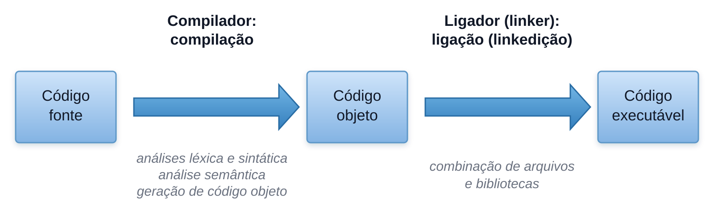
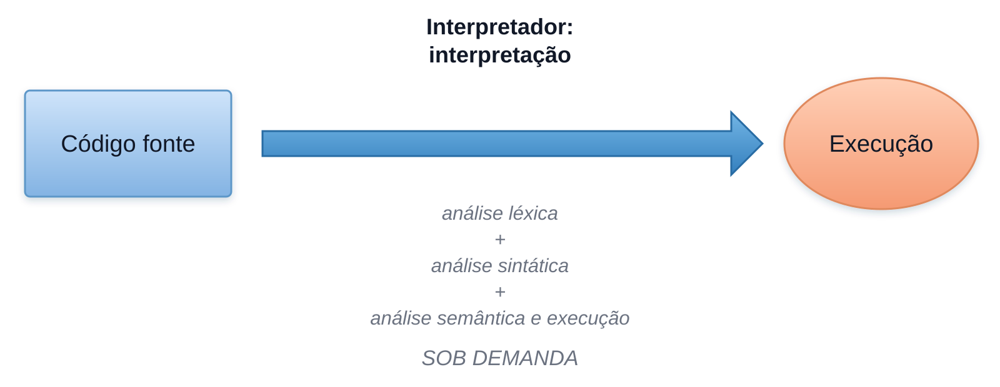
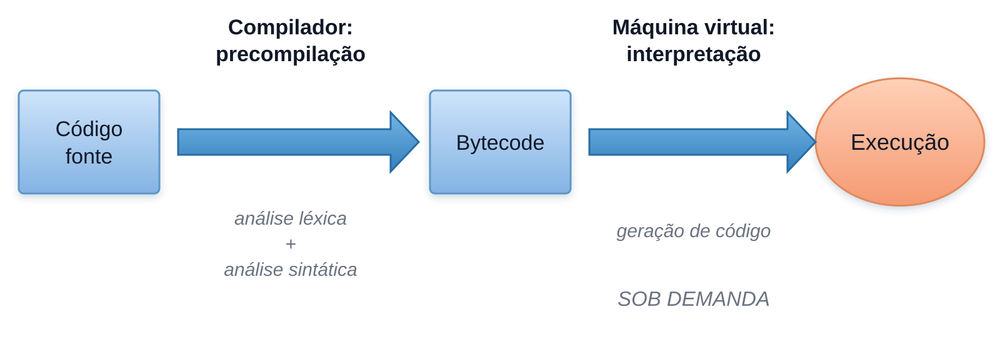
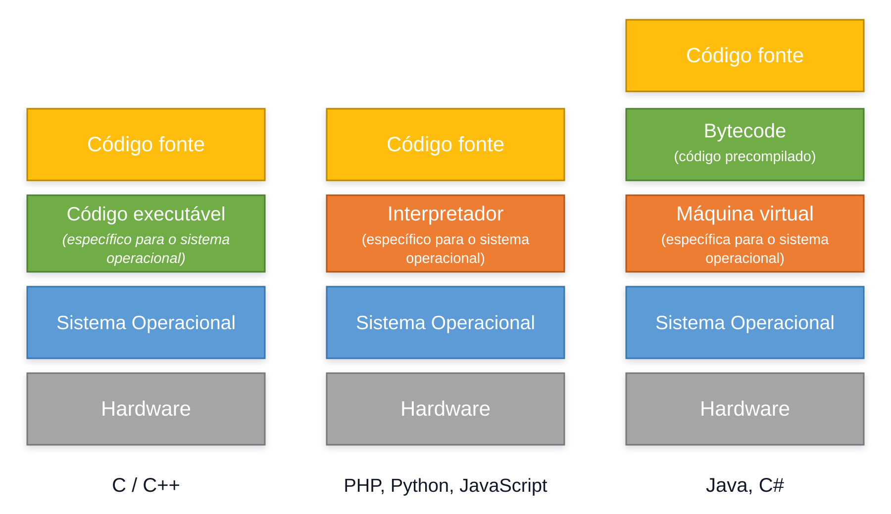

# Tradução e execução de programas

O código escrito pelo programador precisa ser traduzido ou analisado por algum software antes que o processador possa executar suas instruções.

- **Código-fonte:** texto escrito em uma linguagem de programação.
- **Código intermediário:** representação destinada a outro software, como uma máquina virtual.
- **Código objeto:** instruções e metadados gerados para uma plataforma, mas que ainda podem depender de outras etapas de construção.
- **Código executável:** artefato completo que o sistema operacional consegue carregar e iniciar.
- **Código nativo:** instruções específicas para uma arquitetura de processador.

## Compilação

Na abordagem compilada, o código-fonte é traduzido antes da execução. Dependendo da linguagem, o compilador pode produzir código objeto, código intermediário ou código nativo. Arquivos objeto também podem passar por uma etapa de ligação, chamada de *linkedição*, para formar um executável.

> O fluxo é uma representação didática. As etapas e os artefatos gerados variam entre linguagens, compiladores e plataformas.

## Interpretação

Na abordagem interpretada, um interpretador analisa e executa o programa progressivamente. Isso não significa que nenhuma compilação ocorra: algumas implementações geram código intermediário ou nativo internamente.

### Exemplos

- PHP
- JavaScript
- Python
- Ruby

> A classificação é simplificada. Diferentes implementações dessas linguagens podem usar interpretação, bytecode e compilação JIT.

## Abordagem híbrida

Na abordagem híbrida, o código-fonte é compilado para uma representação intermediária, frequentemente chamada de *bytecode*. Uma máquina virtual carrega e verifica esse código e pode interpretá-lo ou compilá-lo para código nativo durante a execução por meio de um compilador JIT (*Just-In-Time*).

### Exemplos

- Java (JVM)
- C# (CLR)

> **CLR (*Common Language Runtime*):** ambiente de execução do .NET que carrega e executa o código intermediário gerado pelo compilador. O CLR também gerencia recursos como memória e exceções e pode usar um compilador JIT para transformar esse código em código nativo durante a execução.

## Vantagens e características

### Compilação

- possibilidade de gerar código nativo otimizado;
- detecção de diversos erros antes da execução;
- o executável nativo pode precisar ser gerado novamente para outra plataforma.

### Interpretação

- ciclo de alteração e execução mais direto;
- portabilidade quando existe um interpretador compatível na plataforma;
- possíveis custos de análise e tradução durante a execução.

### Abordagem híbrida

- portabilidade do código intermediário;
- possibilidade de otimização em tempo de execução com JIT;
- dependência de uma máquina virtual ou runtime compatível.

## Como cada uma das três abordagens funciona:

> Os diagramas apresentam modelos conceituais. Linguagens não são obrigatoriamente limitadas a uma única estratégia; a implementação pode combinar várias técnicas.
