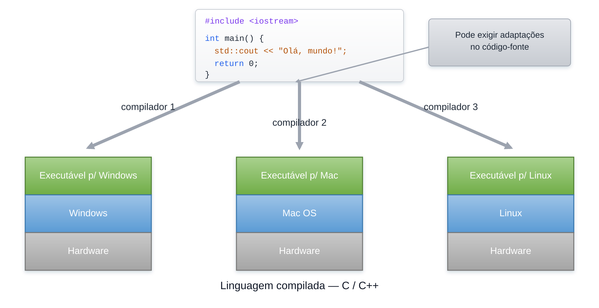
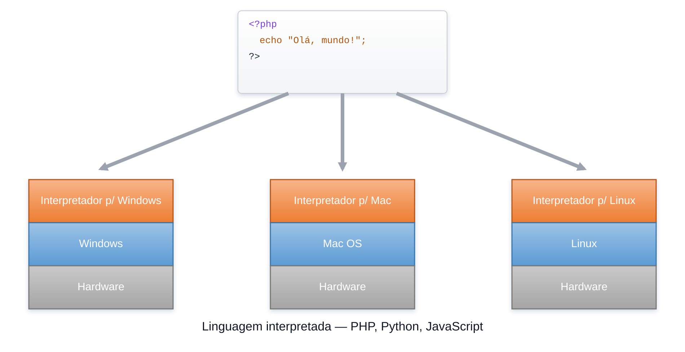
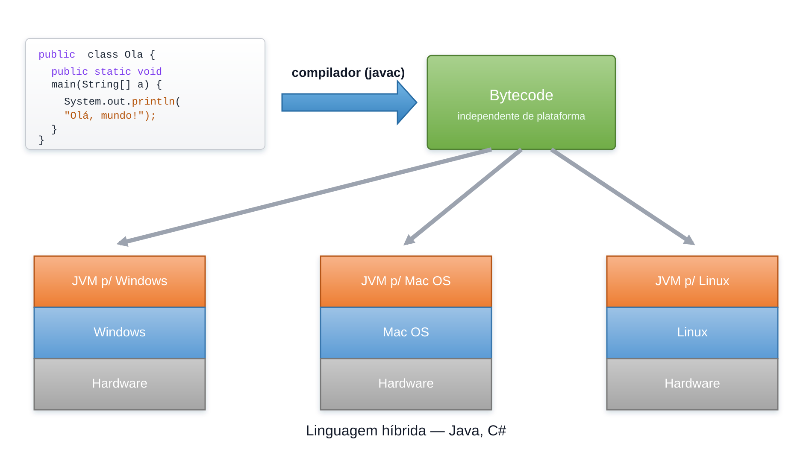
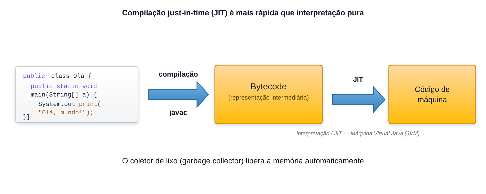

# Plataforma Java SE

<sub>📚 [Documentação](../README.md) › [Seção 2 · Introdução à linguagem Java](./README.md) › Material 2 de 8</sub>

A plataforma Java SE é formada por três peças que costumam ser confundidas entre si.

| Sigla   | Nome                     | O que é                                                                 |
|---------|--------------------------|-------------------------------------------------------------------------|
| **JVM** | *Java Virtual Machine*   | A máquina virtual que carrega, verifica e executa o *bytecode*.          |
| **JRE** | *Java Runtime Environment* | A JVM mais as bibliotecas padrão. É o mínimo para **executar** um programa. |
| **JDK** | *Java Development Kit*   | O JRE mais as ferramentas de desenvolvimento. É o mínimo para **compilar**. |

A relação entre eles é de contenção: **JDK ⊃ JRE ⊃ JVM**.

> [!IMPORTANT]
> A partir do Java 11 a Oracle deixou de distribuir o JRE separadamente. Hoje se instala o JDK e, quando é necessário um pacote menor apenas para execução, gera-se uma imagem de runtime sob medida com a ferramenta `jlink`.

## Ferramentas do JDK

| Ferramenta | Função |
|------------|--------|
| `javac`    | Compila arquivos `.java` em arquivos `.class` com *bytecode*. |
| `java`     | Inicia a JVM e executa uma classe, um `.jar` ou um arquivo-fonte. |
| `jar`      | Empacota classes e recursos em um arquivo `.jar`. |
| `javadoc`  | Gera a documentação HTML a partir dos comentários do código. |
| `jshell`   | Console interativo para testar trechos de código sem criar uma classe. |
| `jlink`    | Cria uma imagem de runtime contendo apenas os módulos necessários. |
| `jdeps`    | Analisa as dependências entre classes, pacotes e módulos. |

## Implementações do Java

O Java é definido por especificações públicas, e várias organizações distribuem sua própria compilação do JDK. O código-base é o mesmo projeto **OpenJDK**; o que muda é o licenciamento, o suporte comercial e o ciclo de atualizações.

- **Oracle JDK** — distribuição comercial da Oracle.
- **Eclipse Temurin (Adoptium)** — distribuição gratuita mantida pela comunidade, muito usada em cursos e em produção.
- **Amazon Corretto**, **Azul Zulu**, **Red Hat build of OpenJDK** — outras distribuições gratuitas com suporte de longo prazo.

> [!NOTE]
> Todas passam pelo mesmo conjunto de testes de compatibilidade (TCK). Em condições equivalentes, um programa compatível pode ser executado nas diferentes distribuições.

## Compilação e interpretação

- Linguagens compiladas: C, C++
- Linguagens interpretadas: PHP, JavaScript
- Linguagens pré-compiladas + máquina virtual: Java, C#

### Exemplo de linguagem compilada


### Exemplo de linguagem interpretada


### Exemplo de linguagem híbrida


## Modelo de execução



O caminho percorrido por um programa Java é sempre o mesmo:

1. O programador escreve o **código-fonte** em arquivos `.java`.
2. O `javac` traduz esse código para **bytecode**, gravado em arquivos `.class`.
3. O comando `java` inicia a **JVM**, que carrega os `.class` necessários.
4. A JVM **verifica** o bytecode, garantindo que ele não viola as regras da plataforma.
5. A JVM **interpreta** o bytecode e, para os trechos executados com frequência, o compilador **JIT** (*Just-In-Time*) gera código nativo otimizado.
6. O **coletor de lixo** (*garbage collector*) recupera automaticamente memória que deixou de ser necessária.

O bytecode é o que garante a portabilidade: ele é o mesmo em qualquer sistema operacional, e quem se adapta à plataforma é a JVM. Daí o lema *write once, run anywhere*.

### Componentes internos da JVM

- **Class Loader:** localiza e carrega os arquivos `.class` sob demanda, a partir do *classpath* ou do *module path*.
- **Verificador de bytecode:** valida o código carregado antes de permitir sua execução.
- **Áreas de memória:** organizam o código e os dados usados durante a execução. A divisão detalhada será estudada junto com orientação a objetos.
- **Motor de execução:** combina interpretação e compilação JIT.
- **Coletor de lixo:** recupera memória automaticamente. O programador não faz a liberação manual usada em algumas outras linguagens.

> A ausência de ponteiros explícitos e o gerenciamento automático de memória são justamente os problemas que o Java se propôs a resolver, conforme visto no material de contextualização.

## Onde as classes são procuradas

Quando a JVM precisa de uma classe, ela a procura em um destes lugares:

- **Classpath:** a forma tradicional, anterior ao Java 9. É uma lista de diretórios e arquivos `.jar` sem qualquer encapsulamento entre eles.
- **Module path:** introduzido no Java 9. Além de localizar as classes, respeita as dependências e o encapsulamento declarados por cada módulo.

```bash
# Usando o classpath
java -cp bin com.exemplo.Programa

# Usando o module path
java --module-path mods --module com.exemplo/com.exemplo.Programa
```

---

<div align="center">

⬅️ [A1 · O que é Java?](./A1%20-%20Contextualiza%C3%A7%C3%A3o%20do%20Java.md) &nbsp;·&nbsp; 📂 [Seção 2](./README.md) &nbsp;·&nbsp; [A3 · Versões do Java (desde a versão 8)](./A3%20-%20Versoes%20do%20Java.md) ➡️

</div>
