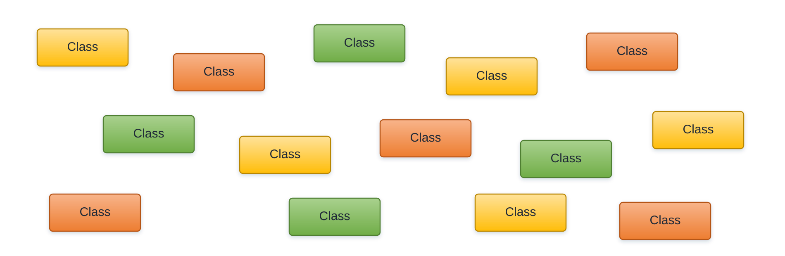
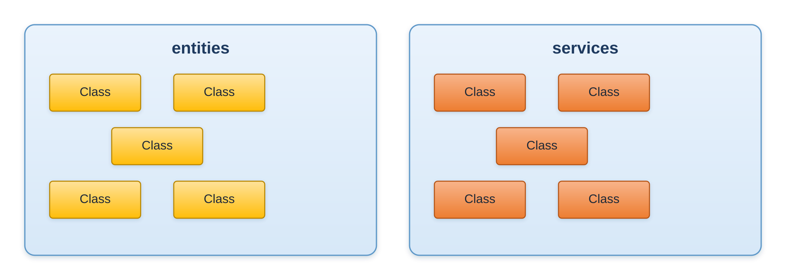
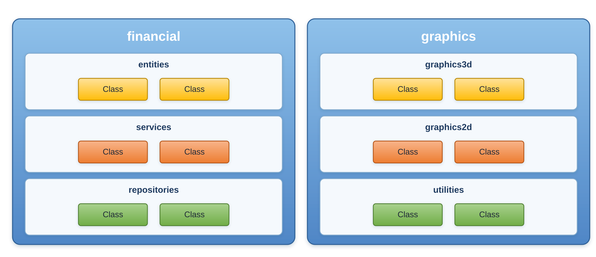
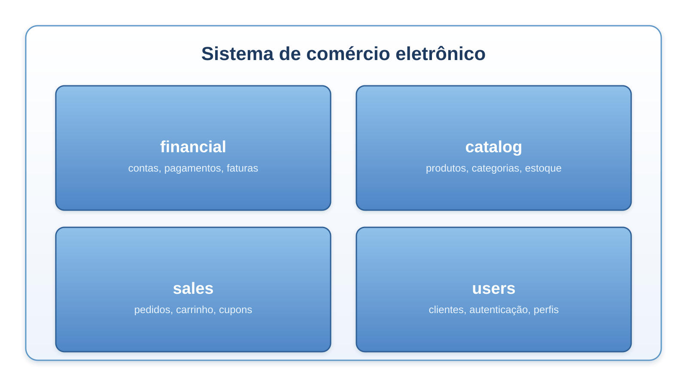

# Estrutura de uma aplicação Java

Java é uma linguagem orientada a objetos. A organização do código segue uma hierarquia de agrupamentos, do menor para o maior:

**classe → pacote → módulo → aplicação**

## Classes

Classe é a unidade lógica básica de um programa orientado a objetos, no nosso caso, a linguagem de programação Java. Todo código Java tem que estar dentro de classes.



```java
public class Produto {
    String nome;
    double preco;

    double precoComDesconto(double percentual) {
        return preco - (preco * percentual / 100);
    }
}
```

### Regras entre classe e arquivo-fonte

Um arquivo `.java` pode conter mais de uma classe, mas precisa respeitar estas regras:

- Um arquivo-fonte pode ter **no máximo uma classe `public`**.
- Se existe uma classe `public`, o **nome do arquivo deve ser idêntico ao nome dessa classe**, respeitando maiúsculas e minúsculas, mais a extensão `.java`.
- Se nenhuma classe do arquivo for `public`, o arquivo pode ter qualquer nome.

```java
// Arquivo: Produto.java
public class Produto {   // pública, dá nome ao arquivo
    // ...
}

class Categoria {        // sem modificador, permitida no mesmo arquivo
    // ...
}
```

> Java diferencia maiúsculas de minúsculas. `Produto` e `produto` são nomes distintos.

## Pacotes

Pacote é um agrupamento lógico de classes relacionadas.



O pacote é declarado na **primeira instrução** do arquivo, antes de qualquer `import` e de qualquer classe. Por convenção usa-se o nome de domínio invertido, todo em minúsculas.

```java
package com.exemplo.produtos;   // 1. declaração de pacote

import java.util.ArrayList;     // 2. importações

public class Inventario {       // 3. declaração de tipo
    private ArrayList<Produto> itens = new ArrayList<>();
}
```

Pontos importantes sobre pacotes:

- A estrutura de diretórios no disco precisa espelhar o nome do pacote: `com/exemplo/produtos/Inventario.java`.
- Classes do pacote `java.lang` (como `String`, `System`, `Math` e `Integer`) são importadas automaticamente.
- Classes do **mesmo pacote** não precisam de `import`.
- Sem `import`, é preciso usar o nome totalmente qualificado: `java.util.ArrayList lista = new java.util.ArrayList();`.
- `import java.util.*;` importa todos os tipos do pacote `java.util`, mas **não** os de seus subpacotes.

## Módulos

Módulos são agrupamentos lógicos de pacotes relacionados. Foram introduzidos na versão 9 do Java, pelo *Project Jigsaw*.

_Observação: Runtime é o agrupamento físico._



Um módulo é declarado em um arquivo chamado `module-info.java`, colocado na raiz do código-fonte do módulo:

```java
module com.exemplo.produtos {
    requires java.sql;                  // do que este módulo depende
    exports com.exemplo.produtos.api;   // o que este módulo torna público
}
```

O que os módulos acrescentam em relação aos pacotes:

- **Encapsulamento forte:** um pacote só é visível de fora do módulo se for explicitamente exportado com `exports`. Pacotes internos ficam realmente inacessíveis.
- **Dependências explícitas:** `requires` declara de quais módulos este depende, e a falta de um deles é detectada logo na inicialização, e não no meio da execução.
- **Imagens menores:** como as dependências são conhecidas, o `jlink` consegue montar um runtime contendo apenas o necessário.

Todo módulo depende implicitamente do módulo `java.base`, que contém `java.lang`, `java.util`, `java.io` e os demais pacotes fundamentais. Por isso não é preciso escrever `requires java.base;`.

### Importação de módulos (Java 25)

A partir do Java 25 é possível importar de uma só vez todos os pacotes exportados por um módulo:

```java
import module java.base;   // equivale a importar java.util, java.io, java.nio.file, ...

public class Exemplo {
    public static void main(String[] args) {
        List<String> nomes = List.of("Ana", "Bruno");   // sem import java.util.List
        System.out.println(nomes);
    }
}
```

## Aplicação

Agrupamento de módulos relacionados.



Na prática, uma aplicação é distribuída de uma destas formas:

- **Arquivo `.jar`:** um pacote compactado com as classes compiladas e seus recursos. Pode ser modular (contém `module-info.class`) ou não modular.
- **Imagem de runtime:** gerada pelo `jlink`, já inclui a JVM e apenas os módulos necessários. Não exige um Java instalado na máquina de destino.

```bash
javac -d bin com/exemplo/produtos/*.java   # compila
jar --create --file app.jar -C bin .       # empacota
java -jar app.jar                          # executa
```
