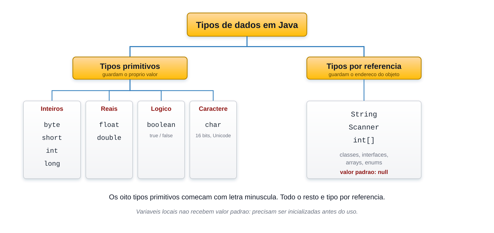
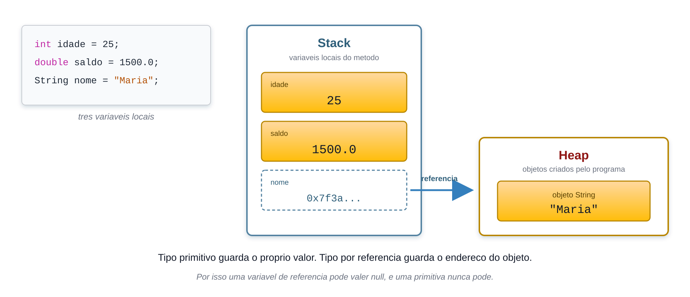

# Variáveis e tipos básicos em Java

Uma **variável** é um espaço nomeado na memória capaz de guardar um valor de um determinado tipo. Java é uma linguagem **estaticamente tipada**: toda variável precisa ser declarada com um tipo antes de ser usada, e esse tipo não muda depois.

```java
int idade;              // declaração
idade = 25;             // atribuição
int quantidade = 10;    // declaração com inicialização
```

## Os dois grandes grupos de tipos



- **Tipos primitivos** — guardam o próprio valor. São exatamente oito, todos escritos em letra minúscula.
- **Tipos por referência** — guardam o endereço de um objeto. `String`, `Scanner`, arrays e todas as classes entram aqui.

## Os oito tipos primitivos

| Tipo | Tamanho | Faixa de valores | Padrão | Uso típico |
|---|---:|---|---|---|
| `byte` | 8 bits | -128 a 127 | `0` | dados binários, economia de memória |
| `short` | 16 bits | -32.768 a 32.767 | `0` | raramente usado |
| `int` | 32 bits | cerca de -2,1 bi a 2,1 bi | `0` | **o inteiro padrão do dia a dia** |
| `long` | 64 bits | cerca de -9,2 a 9,2 quintilhões | `0L` | contadores grandes, milissegundos |
| `float` | 32 bits | cerca de 7 dígitos de precisão | `0.0f` | quando memória importa mais que precisão |
| `double` | 64 bits | cerca de 15 dígitos de precisão | `0.0d` | **o decimal padrão do dia a dia** |
| `boolean` | não definido pela especificação | `true` ou `false` | `false` | condições |
| `char` | 16 bits | 0 a 65.535, um caractere Unicode | caractere de código 0 | uma única letra ou símbolo |

No dia a dia deste curso, quatro tipos resolvem quase tudo: **`int`**, **`double`**, **`char`** e **`boolean`** — mais a classe **`String`**, que não é primitiva.

> Os valores padrão da tabela valem apenas para **atributos de classe**. Uma **variável local** não recebe valor padrão: usá-la sem inicializar é erro de compilação, não de execução.

```java
public class Exemplo {
    static int contador;              // atributo: vale 0 automaticamente

    public static void main(String[] args) {
        int total;
        System.out.println(contador); // 0
        System.out.println(total);    // erro: variable total might not have been initialized
    }
}
```

## Literais e sufixos

O **literal** é o valor escrito diretamente no código. Java assume que todo literal inteiro é `int` e que todo literal com ponto decimal é `double`. Quando isso não serve, é preciso um sufixo:

```java
long populacao = 8_100_000_000L;   // sem o L, o literal estoura o int
float altura = 1.75f;              // sem o f, 1.75 é double e não cabe em float
double preco = 49.90;              // o sufixo d é opcional
```

Erros que decorrem disso:

```java
long errado = 8100000000;    // erro: integer number too large
float errado2 = 1.75;        // erro: incompatible types: possible lossy conversion
```

Outras notações aceitas para literais inteiros:

```java
int decimal = 42;
int hexadecimal = 0x2A;   // prefixo 0x
int octal = 052;          // prefixo 0
int binario = 0b101010;   // prefixo 0b
int legivel = 1_000_000;  // o _ é apenas visual, ignorado pelo compilador
```

O `_` não pode aparecer no início, no fim, ao lado do ponto decimal nem antes de um sufixo `L` ou `F`.

## `char` e `String`

São coisas diferentes, e a aspa denuncia qual é qual:

```java
char letra = 'A';           // aspas simples, um único caractere
String nome = "Alexandre";  // aspas duplas, zero ou mais caracteres
char vazio = '';            // erro: empty character literal
```

Um `char` é numérico por dentro — ele guarda o código Unicode do caractere:

```java
char c = 'A';
System.out.println(c);        // A
System.out.println((int) c);  // 65
System.out.println(c + 1);    // 66  — virou int na operação aritmética
```

## Nomes de variáveis

Regras que o **compilador** exige:

- podem conter letras, dígitos, `_` e `$`, mas **não podem começar com dígito**;
- não podem ser palavras reservadas (`int`, `class`, `for`, `new`, ...);
- diferenciam maiúsculas de minúsculas: `total` e `Total` são variáveis distintas.

Convenções que a **comunidade** segue:

- variáveis e métodos em `camelCase`: `valorTotal`, `precoUnitario`;
- classes em `PascalCase`: `ContaBancaria`;
- constantes em `MAIUSCULAS_COM_UNDERLINE`;
- nada de acentos, cedilha ou espaços — embora o compilador aceite acentos, eles causam problemas de codificação entre sistemas.

```java
int valorTotal;     // bom
int valor_total;    // compila, mas foge da convenção Java
int 2valores;       // erro de compilação
int class;          // erro de compilação: palavra reservada
```

## Declarações múltiplas e `var`

```java
int a = 1, b = 2, c;          // três variáveis int na mesma linha
double x = 1.0, y = 2.0;
```

Desde o Java 10 existe a **inferência de tipo** com `var`, para variáveis locais:

```java
var idade = 25;               // o compilador infere int
var nome = "Maria";           // infere String
var preco = 49.90;            // infere double

var indefinida;               // erro: precisa de inicializador
var nulo = null;              // erro: não há tipo a inferir
```

`var` **não** torna a linguagem dinamicamente tipada: o tipo é fixado na compilação e continua o mesmo até o fim. Neste curso as declarações continuam explícitas, para que o tipo de cada variável fique visível enquanto o assunto ainda é novo.

## Constantes com `final`

Uma variável declarada `final` só pode ser atribuída uma vez:

```java
final double PI = 3.14159;
final int MAXIMO_TENTATIVAS = 3;

PI = 3.15;   // erro: cannot assign a value to final variable PI
```

## Como as variáveis ficam na memória



Uma variável primitiva guarda diretamente o seu valor. Uma variável de referência guarda o **endereço** de um objeto que vive na *heap*. É por isso que uma variável de referência pode valer `null` — ausência de objeto — e uma variável primitiva nunca pode.

```java
int numero = 10;       // a caixa "numero" contém 10
String texto = "Oi";   // a caixa "texto" contém o endereço de um objeto String
String vazio = null;   // a caixa "vazio" não aponta para nada
int erro = null;       // erro de compilação: int não aceita null
```

## Referências

- [OCPJ21 Study Guide — Chapter 4: Working with Data](../ocpj21-book/ch04.md), seção *Understanding Data Types*.
