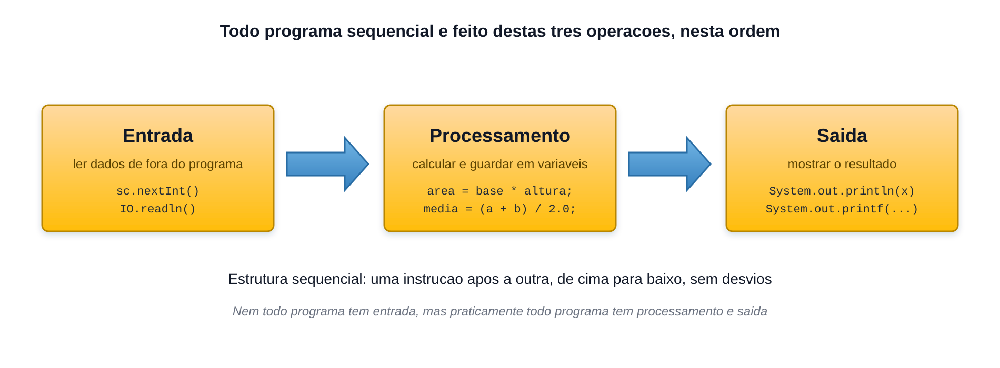

# As três operações básicas de programação

<sub>📚 [Documentação](../README.md) › [Seção 3 · Estrutura sequencial](./README.md) › Material 3 de 8</sub>

Por mais complexo que um sistema pareça, ele é construído sobre três operações elementares:



1. **Entrada de dados** — trazer para dentro do programa informações que vêm de fora: teclado, arquivo, rede, sensor.
2. **Processamento de dados** — calcular, transformar e guardar resultados em variáveis.
3. **Saída de dados** — devolver o resultado para o mundo: tela, arquivo, resposta de rede.

## Estrutura sequencial

Esta seção trata da **estrutura sequencial**: as instruções são executadas **uma após a outra, de cima para baixo**, sem desvios e sem repetições. É a estrutura mais simples das três que o curso vai estudar:

| Estrutura | O que faz | Onde é estudada |
|---|---|---|
| **Sequencial** | executa tudo em ordem, uma vez | Seção 3 |
| Condicional | escolhe entre caminhos alternativos | Seção 4 |
| Repetitiva | repete um trecho enquanto valer uma condição | Seção 5 |

## Um primeiro exemplo, na ordem

Como a leitura pelo teclado ainda será ensinada no A6, os dados de entrada aparecem inicialmente como valores colocados nas variáveis:

```java
// 1. ENTRADA REPRESENTADA POR VALORES INICIAIS
String nome = "Ana";
double nota1 = 7.0;
double nota2 = 8.0;

// 2. PROCESSAMENTO
double media = (nota1 + nota2) / 2.0;

// 3. SAÍDA
System.out.println(nome + " obteve media " + media);
```

O exemplo já permite observar a ordem **entrada, processamento e saída** sem exigir `Scanner` ou formatação com `printf` antes das respectivas aulas. Depois do A6, os valores fixos podem ser substituídos por leituras do teclado.

## Nem todo programa tem as três

- Um programa que só imprime "Olá, mundo!" tem **apenas saída**.
- Um programa que calcula a área de um retângulo com medidas fixas no código tem **processamento e saída**.
- Um programa que pede as medidas ao usuário tem **as três**.

O que praticamente nunca existe é um programa **sem saída**: se ele não devolve nada, não há como saber que funcionou.

## Ordem importa

Como a execução é sequencial, trocar a ordem das instruções muda o resultado ou impede a compilação:

```java
double media = (nota1 + nota2) / 2.0;   // erro: nota1 e nota2 ainda não existem
double nota1 = 7.0;
double nota2 = 8.0;
```

```java
int x = 5;
x = x + 3;
System.out.println(x);   // 8

int y = 5;
System.out.println(y);   // 5  — imprimiu antes de somar
y = y + 3;
```

> [!IMPORTANT]
> Uma variável só pode ser usada **depois** de declarada e inicializada. Essa é uma consequência direta da execução sequencial, e é o primeiro modelo mental que o aluno precisa formar.

## Teste de mesa

Antes de rodar o programa, vale simular a execução no papel, linha a linha, anotando o valor de cada variável. Essa técnica se chama **teste de mesa**, e é a forma mais barata de encontrar um erro de lógica:

```java
int a = 10;
int b = 3;
int c = a / b;
a = c + b;
```

| Linha | `a` | `b` | `c` |
|---|---:|---:|---:|
| `int a = 10;` | 10 | — | — |
| `int b = 3;` | 10 | 3 | — |
| `int c = a / b;` | 10 | 3 | 3 |
| `a = c + b;` | 6 | 3 | 3 |

Repare que `c` vale `3`, e não `3.33`: a divisão entre dois `int` é inteira, como visto no material [A2](./A2%20-%20Expressoes%20aritmeticas.md).

O teste de mesa volta a aparecer na Seção 5, junto com o depurador do Eclipse.

---

<div align="center">

⬅️ [A2 · Expressões aritméticas](./A2%20-%20Expressoes%20aritmeticas.md) &nbsp;·&nbsp; 📂 [Seção 3](./README.md) &nbsp;·&nbsp; [A4 · Saída de dados em Java](./A4%20-%20Saida%20de%20dados%20em%20Java.md) ➡️

</div>
