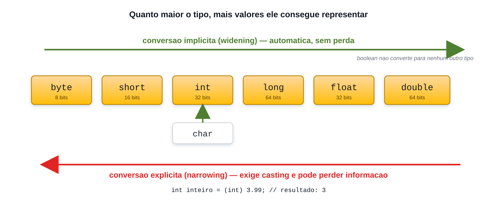

# Processamento de dados e casting

<sub>📚 [Documentação](../README.md) › [Seção 3 · Estrutura sequencial](./README.md) › Material 5 de 8</sub>

Processar é transformar valores e guardar o resultado. Em Java isso acontece por meio de **atribuições** e **conversões de tipo**.

## Atribuição

O `=` **não** é igualdade matemática: ele copia o valor da direita para a variável da esquerda.

```java
int x = 5;
x = x + 3;    // lê-se: o novo x é o x anterior mais 3
```

Por isso `x = x + 3` faz sentido em programação e não faria em matemática.

As formas abreviadas `+=`, `-=`, `++` e `--` serão apresentadas na Seção 4. Por enquanto, todas as atualizações permanecem na forma explícita, como `x = x + 3`.

## Conversão implícita (widening)



Quando o valor cabe com folga no tipo de destino, Java converte sozinho, sem perda:

```java
int inteiro = 100;
double decimal = inteiro;     // 100.0 — conversão automática
long grande = inteiro;        // 100
```

A ordem é `byte → short → int → long → float → double`, e `char → int`. Ir para a **direita** é automático.

> [!NOTE]
> `long` para `float` é conversão implícita mesmo os dois tendo tamanhos diferentes: `float` cobre uma faixa maior de valores, ainda que com menos precisão. É por isso que a ordem da conversão não é a ordem dos tamanhos em bits.

## Conversão explícita (casting)

Ir para a **esquerda** exige que o programador assuma a responsabilidade, escrevendo o tipo entre parênteses:

```java
double valor = 3.99;
int inteiro = (int) valor;      // 3 — a parte decimal é descartada, não arredondada
System.out.println(inteiro);
```

```java
double d = 3.99;
int errado = d;                 // erro: possible lossy conversion from double to int
```

O casting **trunca**, nunca arredonda. Para arredondar existe `Math.round`, no material [A7](./A7%20-%20Funcoes%20matematicas%20em%20Java.md).

### Casting pode estourar silenciosamente

```java
int grande = 300;
byte pequeno = (byte) grande;
System.out.println(pequeno);    // 44 — os bits que não couberam foram descartados
```

Nenhum erro, nenhum aviso: o valor simplesmente fica errado. Esse é o preço de forçar a conversão.

## Promoção numérica em expressões

Antes de calcular, Java **promove** os operandos a um tipo comum. As regras, na ordem:

1. Se um operando for `double`, o outro é promovido a `double`.
2. Senão, se um for `float`, o outro é promovido a `float`.
3. Senão, se um for `long`, o outro é promovido a `long`.
4. Senão, **ambos são promovidos a `int`** — inclusive `byte`, `short` e `char`.

```java
int a = 10;
double b = 3;
System.out.println(a / b);        // 3.3333333333333335 — a virou double

byte x = 10, y = 20;
byte soma = x + y;                // erro: o resultado de x + y é int
byte certo = (byte) (x + y);      // 30 — precisa do casting
```

A regra 4 surpreende: somar dois `byte` produz um `int`. Vale para `short` e `char` também.

```java
char letra = 'A';
System.out.println(letra + 1);          // 66 — virou int
System.out.println((char) (letra + 1)); // B
```

## Dividindo inteiros e esperando decimal

O erro mais frequente da seção, em três versões:

```java
int a = 10, b = 4;

double errado = a / b;             // 2.0 — a divisão inteira aconteceu antes
double certo1 = (double) a / b;    // 2.5 — converte antes de dividir
double certo2 = a / (double) b;    // 2.5
double certo3 = a / 4.0;           // 2.5 — literal já é double
```

## Precisão de ponto flutuante

`double` e `float` guardam números em base 2, e nem todo decimal tem representação exata:

```java
System.out.println(0.1 + 0.2);          // 0.30000000000000004
```

Isso não é bug de Java: é como o padrão IEEE 754 funciona em qualquer linguagem. Nesta seção, basta reconhecer que alguns resultados decimais são aproximações. A comparação de valores será estudada na Seção 4.

## Referências

- [OCPJ21 Study Guide — Chapter 4: Working with Data](../ocpj21-book/ch04.md), seções *Unary Operators*, *Binary Operators* e *Assignment Operators*.

---

<div align="center">

⬅️ [A4 · Saída de dados em Java](./A4%20-%20Saida%20de%20dados%20em%20Java.md) &nbsp;·&nbsp; 📂 [Seção 3](./README.md) &nbsp;·&nbsp; [A6 · Entrada de dados em Java](./A6%20-%20Entrada%20de%20dados%20em%20Java.md) ➡️

</div>
