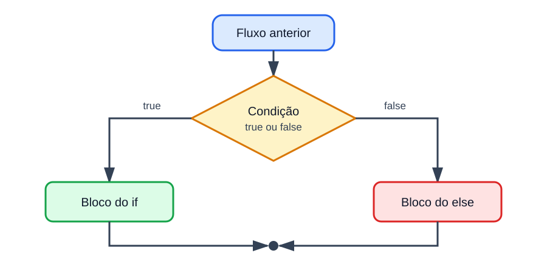

# Estrutura condicional if-else

<sub>📚 [Documentação](../README.md) › [Seção 4 · Estrutura condicional](./README.md) › Material 3 de 8</sub>

A estrutura condicional muda o fluxo sequencial do programa. Em vez de executar todas as instruções, o programa verifica uma condição e escolhe um caminho.



## `if`: executar somente quando for verdadeiro

A forma mais simples executa um bloco apenas quando a condição vale `true`:

```java
double saldo = 500.0;
double saque = 120.0;

if (saque <= saldo) {
    saldo = saldo - saque;
}

System.out.printf("Saldo: %.2f%n", saldo);
```

Se `saque <= saldo` for `true`, o saldo é atualizado. Se for `false`, o bloco entre chaves é ignorado e a execução continua depois do `if`.

A condição precisa produzir `boolean`:

```java
int quantidade = 3;

// if (quantidade) { } // erro: int não pode ser usado como condição
if (quantidade > 0) {
    System.out.println("Ha itens.");
}
```

Java não converte `0` em `false` nem outros inteiros em `true`.

## `if-else`: escolher entre dois caminhos

Quando exatamente um entre dois blocos deve ser executado, use `else`:

```java
double nota = 7.0;

if (nota >= 6.0) {
    System.out.println("Aprovado");
} else {
    System.out.println("Reprovado");
}
```

O `else` não recebe condição. Ele significa "caso contrário": seu bloco executa quando a condição do `if` é `false`.

| `nota` | `nota >= 6.0` | Saída |
| ---: | :---: | --- |
| 8.0 | `true` | `Aprovado` |
| 6.0 | `true` | `Aprovado` |
| 5.9 | `false` | `Reprovado` |

Observe o valor `6.0`, exatamente no limite. Um teste de mesa sempre deve incluir os limites.

## Encadeamento com `else if`

Quando há mais de duas faixas, os testes podem ser encadeados:

```java
double nota = 7.5;

if (nota >= 9.0) {
    System.out.println("Conceito A");
} else if (nota >= 7.0) {
    System.out.println("Conceito B");
} else if (nota >= 6.0) {
    System.out.println("Conceito C");
} else {
    System.out.println("Conceito D");
}
```

As condições são verificadas de cima para baixo. Assim que uma for `true`, seu bloco executa e todo o restante do encadeamento é ignorado.

Com `nota = 9.5`, as expressões `nota >= 9.0`, `nota >= 7.0` e `nota >= 6.0` seriam verdadeiras se fossem avaliadas isoladamente. Mesmo assim, apenas o primeiro bloco executa.

## A ordem das condições importa

Se a condição mais abrangente vier primeiro, ela pode esconder as demais:

```java
double nota = 9.5;

if (nota >= 6.0) {
    System.out.println("Conceito C ou melhor");
} else if (nota >= 9.0) {
    System.out.println("Conceito A"); // nunca será alcançado para uma nota válida
}
```

Toda nota que satisfaz `nota >= 9.0` já satisfez `nota >= 6.0`. Em classificações por limite, organize do maior para o menor ou escreva intervalos completos.

## Condições independentes não formam uma cadeia

Dois `if` separados podem executar juntos:

```java
int numero = 6;

if (numero > 0) {
    System.out.println("Positivo");
}

if (numero % 2 == 0) {
    System.out.println("Par");
}
```

Saída:

```text
Positivo
Par
```

Isso é adequado porque "positivo" e "par" são características independentes. Use `else if` quando os caminhos forem alternativas mutuamente exclusivas.

## Condições aninhadas

Um `if` pode aparecer dentro de outro, mas só deve ser usado quando a segunda pergunta depende da primeira:

```java
double nota = 7.0;
int faltas = 3;

if (nota >= 6.0) {
    if (faltas <= 5) {
        System.out.println("Aprovado");
    } else {
        System.out.println("Reprovado por faltas");
    }
} else {
    System.out.println("Reprovado por nota");
}
```

Quando só interessa saber se as duas exigências foram atendidas, uma condição composta é mais simples:

```java
if (nota >= 6.0 && faltas <= 5) {
    System.out.println("Aprovado");
} else {
    System.out.println("Reprovado");
}
```

A versão aninhada preserva o motivo da reprovação; a versão composta responde apenas ao resultado final.

## Use chaves

Java permite omitir as chaves quando há uma única instrução:

```java
if (saldo < 0)
    System.out.println("Saldo negativo");
```

Durante o curso, mantenha as chaves:

```java
if (saldo < 0) {
    System.out.println("Saldo negativo");
}
```

Sem chaves, apenas a primeira instrução pertence ao `if`. A indentação não muda a execução:

```java
if (saldo < 0)
    System.out.println("Saldo negativo");
    System.out.println("Verifique sua conta"); // executa sempre
```

## Um programa completo

O programa lê um número inteiro e informa seu sinal e sua paridade. Ele usa apenas entrada, operadores e condições estudados até aqui.

```java
import java.util.Scanner;

public class ClassificaNumero {
    public static void main(String[] args) {
        Scanner sc = new Scanner(System.in);

        System.out.print("Digite um numero inteiro: ");
        int numero = sc.nextInt();

        if (numero > 0) {
            System.out.println("Positivo");
        } else if (numero < 0) {
            System.out.println("Negativo");
        } else {
            System.out.println("Zero");
        }

        if (numero % 2 == 0) {
            System.out.println("Par");
        } else {
            System.out.println("Impar");
        }

        sc.close();
    }
}
```

Zero é par porque `0 % 2` resulta em `0`.

## Teste de mesa

Considere este trecho:

```java
int x = 10;
int y = 4;

if (x > y) {
    x = x - y;
} else {
    y = y - x;
}

System.out.println(x + " " + y);
```

| Etapa | `x` | `y` | Observação |
| --- | ---: | ---: | --- |
| inicialização | 10 | 4 | valores iniciais |
| teste `x > y` | 10 | 4 | `true` |
| bloco do `if` | 6 | 4 | `x` recebe `10 - 4` |
| saída | 6 | 4 | imprime `6 4` |

O bloco do `else` não executa. Um teste de mesa deve registrar somente o caminho percorrido.

## Erros comuns

| Erro | Consequência |
| --- | --- |
| usar `=` quando queria `==` | atribuição e comparação são operações diferentes |
| escrever `if (x > 5);` | o ponto e vírgula encerra o `if`; o bloco seguinte executa sempre |
| colocar a faixa mais ampla primeiro | condições mais específicas ficam escondidas |
| esquecer um valor de limite | um caso pode cair no bloco errado |
| omitir chaves e depois adicionar outra linha | só a primeira linha continua condicionada |

## Referências

- [OCPJ21 Study Guide - Chapter 5: Making Decisions](../ocpj21-book/ch05.md), seção *The if Statement*.
- [Java Language Specification 25 - The if-then Statement](https://docs.oracle.com/javase/specs/jls/se25/html/jls-14.html#jls-14.9).

---

<div align="center">

⬅️ [A2 · Expressões lógicas](./A2%20-%20Expressoes%20logicas.md) &nbsp;·&nbsp; 📂 [Seção 4](./README.md) &nbsp;·&nbsp; [A4 · Operadores de atribuição cumulativa](./A4%20-%20Operadores%20de%20atribuicao%20cumulativa.md) ➡️

</div>
