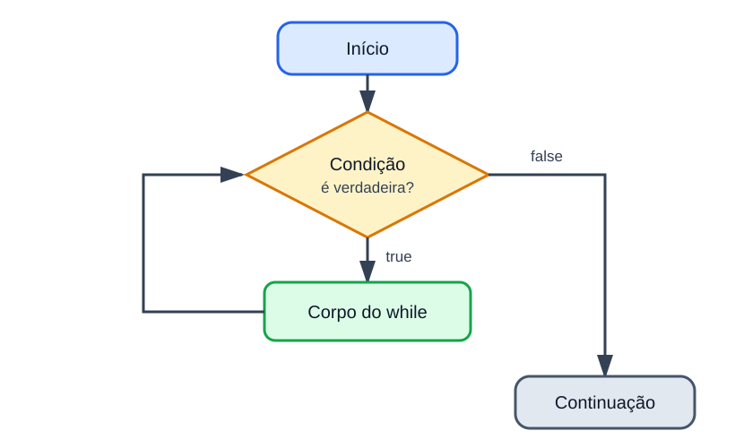

# Estrutura repetitiva while

<sub>📚 [Documentação](../README.md) › [Seção 5 · Estruturas repetitivas](./README.md) › Material 2 de 8</sub>

A estrutura `while` repete um bloco **enquanto** uma condição for verdadeira. Ela é apropriada quando não se sabe de antemão quantas repetições serão necessárias.



## Sintaxe

```java
while (condicao) {
    // instruções repetidas
}
```

O fluxo é:

1. avaliar a condição;
2. se for `false`, sair da repetição;
3. se for `true`, executar o corpo;
4. voltar à condição.

Como a condição vem antes do corpo, o `while` pode executar **zero vezes**.

```java
int numero = -1;

while (numero > 0) {
    System.out.println(numero);
}
```

Nada é impresso, porque a primeira avaliação já produz `false`.

## Primeira repetição com contador

```java
int contador = 1;

while (contador <= 5) {
    System.out.println(contador);
    contador++;
}
```

Saída:

```text
1
2
3
4
5
```

Há três partes:

- **inicialização:** `int contador = 1;`;
- **condição:** `contador <= 5`;
- **atualização:** `contador++`.

Se a atualização for esquecida, `contador` continuará valendo `1`, a condição nunca ficará falsa e o laço será infinito.

## Contador e acumulador

Um **contador** registra quantas vezes algo aconteceu. Um **acumulador** guarda uma soma construída aos poucos.

```java
int numero = 1;
int soma = 0;

while (numero <= 5) {
    soma += numero;
    numero++;
}

System.out.println(soma); // 15
```

`numero` controla a repetição; `soma` começa no elemento neutro da adição, `0`, e recebe cada parcela.

| Iteração | `numero` usado | `soma` depois de `+=` |
| ---: | ---: | ---: |
| 1 | 1 | 1 |
| 2 | 2 | 3 |
| 3 | 3 | 6 |
| 4 | 4 | 10 |
| 5 | 5 | 15 |

## Repetição controlada pela entrada

Quando o usuário decide quando parar, uma variável lida pode controlar a condição:

```java
import java.util.Scanner;

public class SomaPositivos {
    public static void main(String[] args) {
        Scanner sc = new Scanner(System.in);

        int soma = 0;

        System.out.print("Digite um numero positivo ou zero para parar: ");
        int numero = sc.nextInt();

        while (numero > 0) {
            soma += numero;

            System.out.print("Digite outro numero positivo ou zero para parar: ");
            numero = sc.nextInt();
        }

        System.out.println("Soma: " + soma);
        sc.close();
    }
}
```

O valor `0` é uma **sentinela**: ele não entra na soma; apenas sinaliza o fim. A leitura acontece uma vez antes do laço e novamente no fim de cada iteração.

## Padrão de leitura com sentinela

```java
ler primeiro valor

while (valor não é a sentinela) {
    processar valor
    ler próximo valor
}
```

Se a segunda leitura for esquecida, o programa processará o mesmo valor para sempre.

## Validando uma entrada

O `while` também serve para insistir enquanto um valor for inválido:

```java
import java.util.Scanner;

public class LeNota {
    public static void main(String[] args) {
        Scanner sc = new Scanner(System.in);

        System.out.print("Nota de 0 a 10: ");
        double nota = sc.nextDouble();

        while (nota < 0.0 || nota > 10.0) {
            System.out.print("Nota invalida. Digite novamente: ");
            nota = sc.nextDouble();
        }

        System.out.println("Nota registrada: " + nota);
        sc.close();
    }
}
```

O corpo só executa quando a nota está fora do intervalo. Ao receber um valor válido, a condição fica falsa e a repetição termina.

## Contagem regressiva

```java
int contador = 5;

while (contador >= 1) {
    System.out.println(contador);
    contador--;
}

System.out.println("Fim");
```

Quando a variável diminui, a condição precisa ser coerente com esse movimento. `contador <= 5` seria verdadeira para `5`, `4`, `3` e todos os valores menores, produzindo um laço sem fim.

## Laços infinitos

Um laço infinito ocorre quando a condição nunca se torna falsa:

```java
int x = 1;

while (x <= 5) {
    System.out.println(x);
    // faltou atualizar x
}
```

Para interromper um programa preso no Eclipse, use **Terminate**. Depois confira:

- a variável da condição muda dentro do laço?
- ela muda na direção que aproxima do fim?
- o valor limite pode ser alcançado?
- a leitura que deveria trazer um novo valor foi repetida?

## Erros de limite

Compare:

```java
int x = 1;
while (x < 5) {
    System.out.println(x);
    x++;
}
```

Imprime de 1 a 4. Para incluir 5, a condição precisa ser `x <= 5`.

Esse é o erro conhecido como *off-by-one*: executar uma vez a mais ou uma vez a menos por causa do limite.

## Referências

- [OCPJ21 Study Guide - Chapter 5: Making Decisions](../ocpj21-book/ch05.md), seção *The while Loop*.
- [Java Language Specification 25 - The while Statement](https://docs.oracle.com/javase/specs/jls/se25/html/jls-14.html#jls-14.12).

---

<div align="center">

⬅️ [A1 · Depuração no Eclipse](./A1%20-%20Depuracao%20no%20Eclipse.md) &nbsp;·&nbsp; 📂 [Seção 5](./README.md) &nbsp;·&nbsp; [A3 · Teste de mesa com while](./A3%20-%20Teste%20de%20mesa%20com%20while.md) ➡️

</div>
