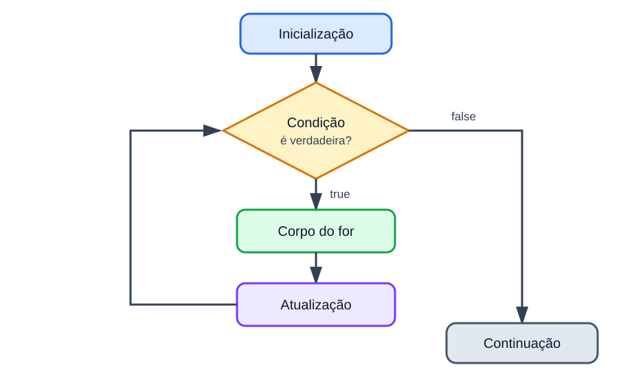

# Estrutura repetitiva for

<sub>📚 [Documentação](../README.md) › [Seção 5 · Estruturas repetitivas](./README.md) › Material 4 de 8</sub>

O `for` organiza em uma única linha as três partes de uma repetição controlada por contador: inicialização, condição e atualização.



## Sintaxe

```java
for (inicializacao; condicao; atualizacao) {
    // corpo repetido
}
```

O exemplo mais simples imprime de 1 a 5:

```java
for (int i = 1; i <= 5; i++) {
    System.out.println(i);
}
```

O fluxo é:

1. executar `int i = 1` uma única vez;
2. testar `i <= 5`;
3. se for verdadeiro, executar o corpo;
4. executar `i++`;
5. voltar à condição.

A atualização ocorre **depois** do corpo.

## Equivalência com `while`

Este `for`:

```java
for (int i = 1; i <= 5; i++) {
    System.out.println(i);
}
```

corresponde a este `while`:

```java
int i = 1;

while (i <= 5) {
    System.out.println(i);
    i++;
}
```

O `for` não é mais poderoso; ele apenas reúne as partes que controlam o contador.

## Quando usar `for`

Use `for` quando a repetição possui um contador claro, por exemplo:

- repetir 10 vezes;
- percorrer números de 1 a 100;
- fazer uma contagem regressiva;
- avançar de 2 em 2;
- calcular uma soma para uma quantidade conhecida de valores.

Quando o fim depende de uma entrada ou de uma condição sem contagem previsível, `while` costuma expressar melhor o problema.

## Limite inclusivo e exclusivo

```java
for (int i = 1; i <= 5; i++) { // inclui 5
    System.out.println(i);
}
```

```java
for (int i = 1; i < 5; i++) { // para antes de 5
    System.out.println(i);
}
```

O primeiro executa cinco vezes; o segundo, quatro. Teste o primeiro valor, o último valor esperado e o valor que encerra o laço.

## Passos diferentes

De 2 em 2:

```java
for (int i = 0; i <= 10; i += 2) {
    System.out.println(i);
}
```

Contagem regressiva:

```java
for (int i = 5; i >= 1; i--) {
    System.out.println(i);
}
```

Em uma contagem regressiva, a atualização diminui e a condição precisa permitir a aproximação do limite final.

## Somatório

```java
int soma = 0;

for (int i = 1; i <= 5; i++) {
    soma += i;
}

System.out.println(soma); // 15
```

O contador `i` existe apenas durante o `for`. O acumulador `soma` foi declarado antes porque seu resultado será usado depois.

```java
// System.out.println(i); // erro: i está fora de escopo
```

## Lendo uma quantidade conhecida de valores

```java
import java.util.Scanner;

public class MediaDeNotas {
    public static void main(String[] args) {
        Scanner sc = new Scanner(System.in);

        System.out.print("Quantidade de notas: ");
        int quantidade = sc.nextInt();
        double soma = 0.0;

        for (int i = 1; i <= quantidade; i++) {
            System.out.print("Nota " + i + ": ");
            double nota = sc.nextDouble();
            soma += nota;
        }

        if (quantidade > 0) {
            double media = soma / quantidade;
            System.out.printf("Media: %.2f%n", media);
        } else {
            System.out.println("Nenhuma nota informada.");
        }

        sc.close();
    }
}
```

Não foi necessário guardar todas as notas. Cada valor é lido, somado e pode ser descartado. Isso mantém o exemplo dentro do conteúdo já estudado, sem arrays.

## Partes opcionais

As três partes do `for` podem ser omitidas, mas os dois pontos e vírgulas permanecem:

```java
int i = 1;

for (; i <= 3; ) {
    System.out.println(i);
    i++;
}
```

Esse código funciona, porém um `while` seria mais natural.

Sem condição, o laço é infinito:

```java
for (;;) {
    System.out.println("Repete para sempre");
}
```

Esse formato será usado apenas quando houver uma forma explícita e clara de encerrar o laço.

## Mais de uma atualização

Java aceita expressões separadas por vírgula nas partes de inicialização e atualização:

```java
for (int esquerda = 1, direita = 5; esquerda <= direita; esquerda++, direita--) {
    System.out.println(esquerda + " " + direita);
}
```

Isso compila, mas não é o melhor primeiro formato. Um contador simples por laço torna o teste de mesa mais fácil.

## Laços aninhados sem arrays

Um laço pode aparecer dentro de outro. O exemplo imprime três linhas com quatro asteriscos:

```java
for (int linha = 1; linha <= 3; linha++) {
    for (int coluna = 1; coluna <= 4; coluna++) {
        System.out.print("*");
    }
    System.out.println();
}
```

Para cada valor de `linha`, o laço interno percorre todos os quatro valores de `coluna`. O corpo interno executa `3 * 4 = 12` vezes.

Laços aninhados devem ser estudados depois que um único `for` já estiver claro.

## Referências

- [OCPJ21 Study Guide - Chapter 5: Making Decisions](../ocpj21-book/ch05.md), seção *The for Loop*.
- [Java Language Specification 25 - The basic for Statement](https://docs.oracle.com/javase/specs/jls/se25/html/jls-14.html#jls-14.14.1).

---

<div align="center">

⬅️ [A3 · Teste de mesa com while](./A3%20-%20Teste%20de%20mesa%20com%20while.md) &nbsp;·&nbsp; 📂 [Seção 5](./README.md) &nbsp;·&nbsp; [A5 · Teste de mesa com for](./A5%20-%20Teste%20de%20mesa%20com%20for.md) ➡️

</div>
