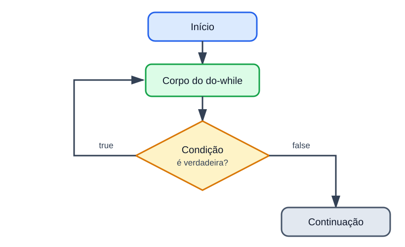

# Estrutura repetitiva do-while

<sub>📚 [Documentação](../README.md) › [Seção 5 · Estruturas repetitivas](./README.md) › Material 6 de 8</sub>

A estrutura `do-while` testa a condição **depois** do corpo. Por isso, o bloco executa pelo menos uma vez.



## Sintaxe

```java
do {
    // instruções repetidas
} while (condicao);
```

O ponto e vírgula depois do parêntese é obrigatório.

O fluxo é:

1. executar o corpo;
2. avaliar a condição;
3. se for `true`, voltar ao corpo;
4. se for `false`, continuar depois do laço.

## Diferença para `while`

```java
int x = 10;

while (x < 5) {
    System.out.println("while");
}
```

Nada é impresso, porque a condição já começa falsa.

```java
int x = 10;

do {
    System.out.println("do-while");
} while (x < 5);
```

`do-while` é impresso uma vez. A condição só é verificada depois.

## Quando usar

`do-while` é apropriado quando a primeira execução precisa acontecer antes de ser possível testar a continuidade:

- mostrar um menu e depois perguntar se o usuário quer repetir;
- ler um valor e depois perguntar se há outro;
- executar uma tentativa antes de verificar se ela deve ser refeita.

Se a repetição pode legitimamente executar zero vezes, `while` costuma ser mais natural.

## Menu simples

```java
import java.util.Scanner;

public class MenuRepetido {
    public static void main(String[] args) {
        Scanner sc = new Scanner(System.in);
        int opcao;

        do {
            System.out.println("1 - Mostrar mensagem");
            System.out.println("0 - Sair");
            System.out.print("Opcao: ");
            opcao = sc.nextInt();

            switch (opcao) {
                case 1:
                    System.out.println("Ola!");
                    break;
                case 0:
                    System.out.println("Encerrando.");
                    break;
                default:
                    System.out.println("Opcao invalida.");
                    break;
            }
        } while (opcao != 0);

        sc.close();
    }
}
```

O menu aparece antes de `opcao` ter um valor digitado. A declaração acontece fora do laço porque a condição precisa ler a variável depois do bloco.

## Validação com `do-while`

```java
double nota;

do {
    System.out.print("Digite uma nota de 0 a 10: ");
    nota = sc.nextDouble();
} while (nota < 0.0 || nota > 10.0);

System.out.println("Nota registrada: " + nota);
```

Aqui a leitura precisa ocorrer pelo menos uma vez. O `do-while` evita duplicar a primeira leitura antes do laço.

Compare com o padrão do `while`:

```java
System.out.print("Digite uma nota de 0 a 10: ");
double nota = sc.nextDouble();

while (nota < 0.0 || nota > 10.0) {
    System.out.print("Digite novamente: ");
    nota = sc.nextDouble();
}
```

As duas versões funcionam. O `do-while` concentra a leitura repetida em um único lugar.

## Teste de mesa

```java
int x = 1;

do {
    System.out.println(x);
    x += 2;
} while (x <= 5);
```

| Iteração | `x` impresso | `x` depois de `+= 2` | Condição |
| ---: | ---: | ---: | :---: |
| 1 | 1 | 3 | `true` |
| 2 | 3 | 5 | `true` |
| 3 | 5 | 7 | `false` |

A saída é `1`, `3` e `5`.

## O ponto e vírgula que muda de papel

No `do-while`, o ponto e vírgula final faz parte da sintaxe correta:

```java
do {
    x++;
} while (x < 5);
```

No `while` comum, um ponto e vírgula logo após a condição cria um corpo vazio:

```java
while (x < 5); // cuidado: laço vazio
{
    x++;
}
```

Se `x` começar menor que 5, o segundo exemplo fica preso, porque o laço vazio não altera `x`.

## Escopo da variável de controle

Este código não compila:

```java
do {
    int opcao = sc.nextInt();
} while (opcao != 0); // opcao está fora de escopo
```

A condição fica fora do bloco entre chaves. Declare antes:

```java
int opcao;

do {
    opcao = sc.nextInt();
} while (opcao != 0);
```

## Referências

- [OCPJ21 Study Guide - Chapter 5: Making Decisions](../ocpj21-book/ch05.md), seção *The while Loop*.
- [Java Language Specification 25 - The do Statement](https://docs.oracle.com/javase/specs/jls/se25/html/jls-14.html#jls-14.13).

---

<div align="center">

⬅️ [A5 · Teste de mesa com for](./A5%20-%20Teste%20de%20mesa%20com%20for.md) &nbsp;·&nbsp; 📂 [Seção 5](./README.md) &nbsp;·&nbsp; [A7 · Escolhendo a estrutura de repetição](./A7%20-%20Escolhendo%20a%20estrutura%20de%20repeticao.md) ➡️

</div>
