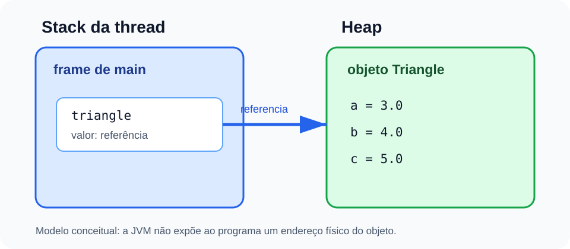

# Referências, stack, heap e coleta de lixo

<sub>📚 [Documentação](../README.md) › [Seção 7 · Introdução à Programação Orientada a Objetos](./README.md) › Material 4 de 8</sub>

Uma variável primitiva guarda um valor do próprio tipo. Uma variável de classe guarda uma **referência**, isto é, um valor usado para chegar a um objeto.

```java
double price = 10.0;
Triangle triangle = new Triangle();
```

- `price` contém o valor numérico `10.0`;
- `triangle` contém uma referência ao objeto criado por `new Triangle()`.

## Um modelo conceitual de memória



Para acompanhar programas simples, usaremos este modelo:

- cada chamada de método possui um **frame** na stack da thread;
- o frame mantém variáveis locais e dados necessários à execução do método;
- instâncias de classes são alocadas na heap;
- uma variável local de tipo de referência pode apontar para um objeto na heap.

Esse é um modelo da JVM, não um convite para calcular endereços físicos. A especificação permite liberdade de implementação; por exemplo, frames podem até ser alocados na heap por uma JVM.

## Atribuir uma referência não copia o objeto

```java
Triangle first = new Triangle();
first.a = 3.0;

Triangle second = first;
second.a = 9.0;

System.out.println(first.a); // 9.0
```

Depois de `second = first`, as duas variáveis contêm referências ao **mesmo objeto**. Isso é chamado de aliasing: mais de uma referência permite chegar à mesma instância.

Compare com valores primitivos:

```java
double firstValue = 3.0;
double secondValue = firstValue;
secondValue = 9.0;

System.out.println(firstValue); // 3.0
```

A atribuição primitiva copia o valor. A atribuição de referência copia a referência.

## A referência especial `null`

`null` significa que não há objeto referenciado:

```java
Triangle triangle = null;
```

A declaração e a comparação são válidas:

```java
if (triangle == null) {
    System.out.println("No triangle");
}
```

Tentar acessar um membro por uma referência `null` causa `NullPointerException` durante a execução:

```java
// System.out.println(triangle.a); // falha em tempo de execução
```

O tratamento de exceções será ensinado em uma seção própria. Por enquanto, verifique a referência antes do acesso quando `null` for possível.

## Elegibilidade para coleta de lixo

Considere:

```java
Triangle first = new Triangle();  // objeto 1
Triangle second = new Triangle(); // objeto 2

first = second;
```

Após a última instrução:

- `first` e `second` referenciam o objeto 2;
- o objeto 1 não pode mais ser alcançado por essas referências;
- o objeto 1 torna-se **elegível** para coleta de lixo.

Elegível não significa “removido imediatamente”. O garbage collector decide quando recuperar a memória. Uma chamada a `System.gc()` é apenas uma solicitação e não garante uma coleta naquele instante.

Quando um método termina, seu frame deixa de ser necessário. Se referências locais eram o único caminho até certos objetos, esses objetos podem se tornar elegíveis para coleta.

## Passagem por valor continua valendo

Java passa argumentos por valor. Para uma referência, o valor copiado é a própria referência:

```java
static void changeSide(Triangle value) {
    value.a = 20.0;
}
```

O parâmetro `value` recebe uma cópia da referência. Portanto, consegue alterar o mesmo objeto. Reatribuir apenas o parâmetro seria diferente:

```java
static void replace(Triangle value) {
    value = new Triangle();
    value.a = 50.0;
}
```

Essa reatribuição não muda a variável do chamador, porque só altera a cópia local da referência.

## O que guardar

- objetos e variáveis de referência não são a mesma coisa;
- copiar uma referência não copia o objeto;
- `null` não é um objeto;
- um objeto inalcançável pode ser coletado, mas não há garantia de momento;
- Java não oferece desalocação manual de objetos.

## Referências

- [JVMS 25 - Java Virtual Machine Stacks](https://docs.oracle.com/javase/specs/jvms/se25/html/jvms-2.html#jvms-2.5.2).
- [JVMS 25 - Heap](https://docs.oracle.com/javase/specs/jvms/se25/html/jvms-2.html#jvms-2.5.3).
- [JLS 25 - Class Instance Creation](https://docs.oracle.com/javase/specs/jls/se25/html/jls-15.html#jls-15.9.4).

---

<div align="center">

⬅️ [A3 · Métodos de instância](./A3%20-%20Metodos%20de%20instancia.md) &nbsp;·&nbsp; 📂 [Seção 7](./README.md) &nbsp;·&nbsp; [A5 · `Object` e `toString`](./A5%20-%20Object%20e%20toString.md) ➡️

</div>
