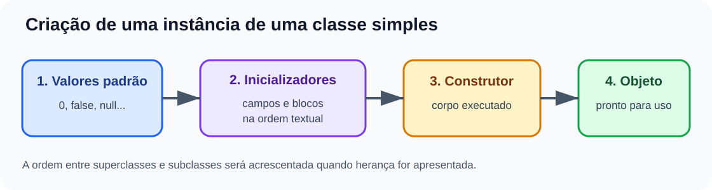

# Ordem de inicialização

<sub>📚 [Documentação](../README.md) › [Seção 8 · Construtores, palavra this, sobrecarga e encapsulamento](./README.md) › Material 4 de 8</sub>

Criar um objeto envolve mais do que executar as instruções visíveis no final de um construtor. Nesta aula, acompanharemos uma única classe, sem herança.

## Quatro etapas observáveis



Para uma classe simples, pense nesta sequência:

1. os campos recebem valores padrão;
2. inicializadores de campos e blocos de instância executam na ordem textual;
3. o corpo do construtor executa;
4. a referência ao objeto inicializado fica disponível para a expressão que usou `new`.

## Exemplo completo

```java
public class Example {
    public int first = initialize("field first", 1);

    {
        System.out.println("instance block");
        first = 2;
    }

    public int second = initialize("field second", 3);

    public Example() {
        System.out.println("constructor");
        second = 4;
    }

    private int initialize(String message, int value) {
        System.out.println(message);
        return value;
    }
}
```

Ao executar `new Example()`, a saída é:

```text
field first
instance block
field second
constructor
```

Ao final, `first` vale `2` e `second` vale `4`.

Os valores padrão existiram antes dessa sequência visível: ambos os campos começaram com `0`.

## A ordem textual importa

Inicializadores de campos e blocos de instância são intercalados na ordem em que aparecem no arquivo:

```java
public int a = 1;

{
    a = 2;
}

public int b = a; // recebe 2
```

O construtor executa depois e ainda pode substituir os valores.

## Bloco estático não é bloco de instância

```java
public class Sequence {
    public static int classValue;
    public int objectValue;

    static {
        System.out.println("static block");
        classValue = 1;
    }

    {
        System.out.println("instance block");
        objectValue = 2;
    }

    public Sequence() {
        System.out.println("constructor");
        objectValue = 3;
    }
}
```

- o bloco `static` participa da inicialização da classe e não roda a cada `new`;
- o bloco de instância roda para cada objeto;
- o construtor selecionado roda depois dos inicializadores de instância.

Se dois objetos forem criados após a classe já estar inicializada, a saída típica será:

```text
static block
instance block
constructor
instance block
constructor
```

## Encadeamento de construtores

Quando um construtor chama outro com `this(...)`, os inicializadores de instância não são repetidos. Eles executam uma vez durante a criação daquele objeto.

```java
public class NumberHolder {
    public int value = 1;

    public NumberHolder() {
        this(2);
        value++;
    }

    public NumberHolder(int value) {
        this.value = value;
    }
}
```

Após `new NumberHolder()`, `value` vale `3`:

1. o inicializador atribui `1`;
2. o construtor com `int` atribui `2`;
3. o construtor sem argumentos incrementa para `3`.

## Limite desta explicação

Classes sempre possuem uma relação com uma superclasse, mas a ordem completa entre superclasses e subclasses será estudada com herança. Aqui basta consolidar a ordem interna de uma classe e reconhecer `static` versus instância.

## Referências

- [JLS 25 - Instance Initializers](https://docs.oracle.com/javase/specs/jls/se25/html/jls-8.html#jls-8.6).
- [JLS 25 - Static Initializers](https://docs.oracle.com/javase/specs/jls/se25/html/jls-8.html#jls-8.7).
- [JLS 25 - Creation of New Class Instances](https://docs.oracle.com/javase/specs/jls/se25/html/jls-12.html#jls-12.5).

---

<div align="center">

⬅️ [A3 · Sobrecarga e encadeamento de construtores](./A3%20-%20Sobrecarga%20e%20encadeamento%20de%20construtores.md) &nbsp;·&nbsp; 📂 [Seção 8](./README.md) &nbsp;·&nbsp; [A5 · Encapsulamento, getters e setters](./A5%20-%20Encapsulamento%20getters%20e%20setters.md) ➡️

</div>
